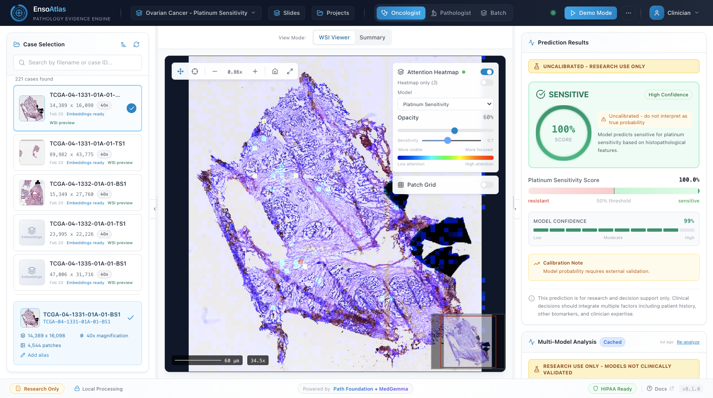
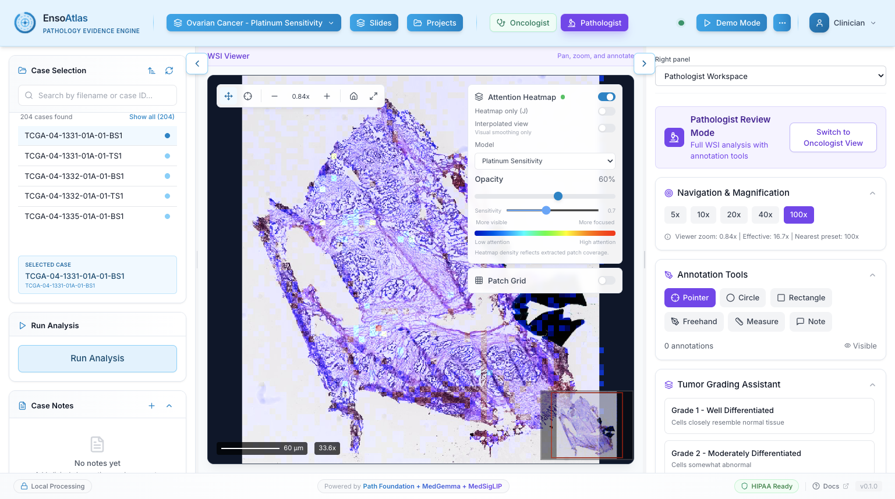
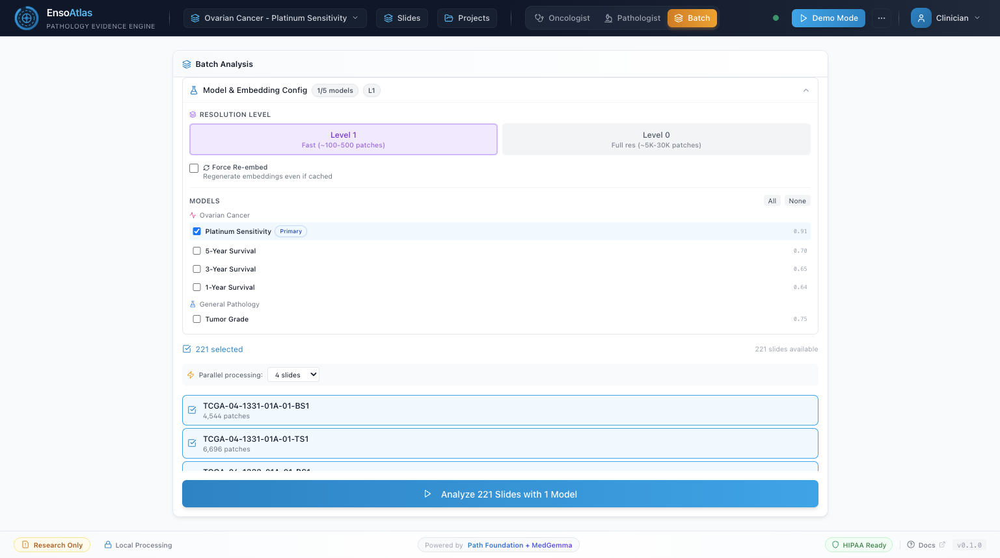
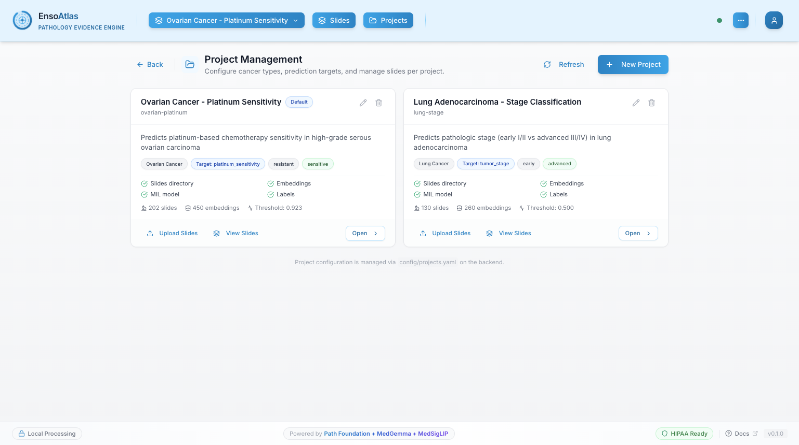

# Enso Atlas

<div align="center">

### Production-Grade Multi-Project Pathology AI Platform  
Built on Google Health AI Developer Foundations (HAI-DEF)

[](https://www.kaggle.com/competitions/med-gemma-impact-challenge/writeups/Enso-Atlas)
[](https://www.kaggle.com/competitions/med-gemma-impact-challenge)
[](#)
[](#)
[](https://www.python.org/downloads/)
[](https://opensource.org/licenses/MIT)

[Competition Write-up](https://www.kaggle.com/competitions/med-gemma-impact-challenge/writeups/Enso-Atlas) • [Documentation](docs.md) • [Quick Start](#quick-start) • [Pipeline Scripts](#pipeline-scripts)

</div>

**Last Updated:** February 24, 2026

---

## Overview

### Clinical Problem
Current oncology workflows often identify treatment resistance only after patients complete toxic therapy. In platinum-based ovarian cancer, the morphological signal for resistance may already be present in the diagnostic slide; the challenge is extracting it in a traceable and clinically usable way.

### What we built
- **Platform, not a single model:** One system that supports multiple endpoints and cancer projects
- **Evidence-first predictions:** Attention heatmaps tied to tissue regions, plus similar-case retrieval
- **Reusable embeddings:** Path Foundation patch embeddings cached for downstream tasks
- **Multimodal interpretation:** MedSigLIP semantic patch search and MedGemma structured report generation
- **Operational output:** One-click PDF reports for tumor board workflows

### What makes this deployment practical
- Fully local deployment with no PHI leaving the hospital network
- Strict project isolation across data, model visibility, inference, and async tasks
- New cancer type onboarding through configuration plus checkpoint registration
- Docker-based deployment targeting a single DGX Spark node

### Current reference deployment
- `ovarian-platinum` project: platinum sensitivity, tumor grade, and 1/3/5-year survival tasks
- `lung-stage` project: lung adenocarcinoma stage classification
- Total: 6 project-scoped classification models (5 ovarian + 1 lung)

### Impact framing
Retrospective analyses suggest meaningful potential to reduce avoidable toxicity and cost by flagging likely non-responders earlier. Prospective, multi-site clinical validation is still required before clinical deployment decisions.

---

## Highlights

- **Multi-project architecture** driven by `config/projects.yaml`
- **Strict project isolation** for slides, models, heatmaps, retrieval, reporting, and async jobs
- **Project-scoped model visibility** (6 total models, exposed only where assigned)
- **Level-0 dense embeddings by default** for analysis and multi-model workflows
- **Explicit backend errors** for missing prerequisites (`LEVEL0_EMBEDDINGS_REQUIRED`, `COORDS_REQUIRED_FOR_HEATMAP`)
- **Dual heatmap rendering modes** (truthful patch-grid and optional smoothed interpolation)
- **Project-aware frontend behavior** with stale model pruning on project switch
- **Canonical pipeline scripts** documented and aligned with deployed model preparation flow
- **Local-first operation** with no required cloud runtime path

---

## Screenshots

### Dashboard (Oncologist View)



*Current UI in Oncologist mode with project-scoped model selection and evidence panels.*

### Dashboard (Pathologist View)



*Current UI in Pathologist mode with project-aware interpretation workflow and tool visibility.*

### Batch Analysis



*Batch analysis view showing project-scoped model selection, resolution controls, and cohort-level run setup.*

### Slide Manager


*Project-scoped slide inventory with filtering, readiness metadata, and per-project organization controls.*

### Project Management



*Project configuration and assignment workflow backed by `config/projects.yaml` and project-specific data/model mappings.*

---

## Quick Start

### Docker Deployment (Recommended)

```bash
# Clone the repository
git clone https://github.com/Hilo-Hilo/med-gemma-hackathon.git
cd med-gemma-hackathon

# Build and start backend + database
docker compose -f docker/docker-compose.yaml build
docker compose -f docker/docker-compose.yaml up -d

# Backend API available at http://localhost:8003 (~3.5 min startup for MedGemma loading)

# Build and start frontend
cd frontend
npm install
npm run build
npx next start -p 3002

# Frontend available at http://localhost:3002
```

### Local Development

```bash
# Create virtual environment
python -m venv .venv
source .venv/bin/activate

# Install dependencies
pip install -e .

# Start the API server (port 8000 locally, 8003 via Docker)
python -m uvicorn enso_atlas.api.main:app --reload --host 0.0.0.0 --port 8000

# In a separate terminal
cd frontend
npm install
npm run dev
# Frontend runs at http://localhost:3000 (dev) or http://localhost:3002 (production)
```

---

## Architecture

```
                        Enso Atlas Multi-Project Architecture

  config/projects.yaml
          |
          v
+----------------------+      +-------------------------+      +------------------+
|  Project Registry    |----->|   FastAPI Backend       |<-----|   Next.js 14     |
|  (project metadata,  |      |   project-scoped APIs   |      |   Frontend :3002 |
|  dataset + model map)|      |        :8003            |      +------------------+
+----------------------+      +-------------------------+
                                        |
                 +----------------------+-----------------------------+
                 |                      |                             |
                 v                      v                             v
          +-------------+        +--------------+              +-------------+
          | Path        |        | TransMIL     |              | MedGemma    |
          | Foundation  |        | Classifiers  |              | Reporting   |
          | (level-0)   |        | (project set)|              | (async)     |
          +-------------+        +--------------+              +-------------+
                 |                      |                             |
                 +----------------------+-----------------------------+
                                        |
                                 +-------------+
                                 | PostgreSQL  |
                                 | project_*   |
                                 | junctions   |
                                 +-------------+
```

### Core Components

| Component | Description |
|-----------|-------------|
| **Project Registry** | Loads `config/projects.yaml`, including project IDs, dataset paths, and per-project model assignments |
| **Project-Scoped Routing** | Endpoints enforce `project_id` scope for slides, models, analysis, retrieval, and reports |
| **WSI Processing** | OpenSlide-based processing with tissue detection |
| **Path Foundation** | 384-dim patch embeddings; level-0 dense embeddings are the default analysis path |
| **TransMIL** | Transformer-based MIL for slide-level classification |
| **MedSigLIP** | Text-to-patch semantic search (project-scoped availability) |
| **FAISS Retrieval** | Similar case search constrained to slides in the selected project |
| **MedGemma 1.5 4B** | Structured clinical report generation with project-aware context |
| **PostgreSQL** | Slide metadata, result caching, and project-model / project-slide assignments |

### Classification Results

| Model | Project Scope | Task | AUC |
|-------|---------------|------|-----|
| platinum_sensitivity | ovarian-platinum | Platinum treatment response | 0.907 |
| tumor_grade | ovarian-platinum | Tumor grade classification | 0.752 |
| survival_5y | ovarian-platinum | 5-year survival prediction | 0.697 |
| survival_3y | ovarian-platinum | 3-year survival prediction | 0.645 |
| survival_1y | ovarian-platinum | 1-year survival prediction | 0.639 |
| lung_stage | lung-stage | Lung adenocarcinoma stage classification (early vs advanced) | 0.648 |

Total: **6 project-scoped classification models** (5 ovarian + 1 lung).

### Tech Stack

| Layer | Technology |
|-------|------------|
| WSI I/O | OpenSlide |
| Embeddings | Path Foundation (ViT-S, 384-dim) |
| Semantic Search | MedSigLIP (text-to-patch retrieval) |
| Classification | TransMIL (Transformer-based MIL) |
| Retrieval | FAISS |
| Reporting | MedGemma 1.5 4B |
| Backend | FastAPI + Python 3.10+ + asyncpg |
| Frontend | Next.js 14.2 + TypeScript + Tailwind CSS |
| Viewer | OpenSeadragon |
| Database | PostgreSQL |
| Deployment | Docker Compose on NVIDIA DGX Spark (ARM64) |

---

## API Reference

All endpoints are served at `http://localhost:8003` (Docker) or `http://localhost:8000` (local).

### Core Endpoints

```bash
# Health check
curl http://localhost:8003/api/health

# List slides in ovarian project
curl "http://localhost:8003/api/slides?project_id=ovarian-platinum"

# List project-scoped models
curl "http://localhost:8003/api/models?project_id=lung-stage"

# Multi-model analysis (renamed endpoint)
curl -X POST http://localhost:8003/api/analyze-multi \
  -H "Content-Type: application/json" \
  -d '{"slide_id": "TCGA-XX-XXXX", "project_id": "lung-stage"}'

# Batch analysis (project-scoped)
curl -X POST http://localhost:8003/api/analyze-batch \
  -H "Content-Type: application/json" \
  -d '{"slide_ids": ["slide_1", "slide_2"], "project_id": "ovarian-platinum"}'

# Generate clinical report (project-scoped)
curl -X POST http://localhost:8003/api/report \
  -H "Content-Type: application/json" \
  -d '{"slide_id": "TCGA-XX-XXXX", "project_id": "ovarian-platinum"}'

# Similar-case retrieval (project-scoped)
curl "http://localhost:8003/api/similar?slide_id=TCGA-XX-XXXX&project_id=lung-stage"
```

### Full Endpoint List

| Method | Endpoint | Description |
|--------|----------|-------------|
| GET | /api/health | Health check |
| GET | /api/slides?project_id={project_id} | List slides scoped to a project |
| GET | /api/models?project_id={project_id} | List models assigned to a project |
| POST | /api/analyze | Single-slide analysis (`project_id` in request body) |
| POST | /api/analyze-multi | Multi-model analysis (`project_id` in request body) |
| POST | /api/analyze-batch | Synchronous batch analysis (`project_id` in request body) |
| POST | /api/analyze-batch/async | Async batch analysis task (`project_id` in request body) |
| GET | /api/analyze-batch/status/{task_id} | Check async batch task status |
| POST | /api/report | Generate report (`project_id` in request body) |
| POST | /api/report/async | Async report generation (`project_id` in request body) |
| GET | /api/report/status/{task_id} | Check async report task status |
| GET | /api/similar?slide_id={id}&project_id={project_id} | Similar-case retrieval within project scope |
| POST | /api/semantic-search | MedSigLIP semantic search (`project_id` in request body) |
| GET | /api/heatmap/{slide_id}?project_id={project_id}&smooth={bool} | Slide heatmap with optional interpolation |
| GET | /api/heatmap/{slide_id}/{model_id}?project_id={project_id}&smooth={bool} | Model-specific attention heatmap |
| GET/POST/PUT/DELETE | /api/projects | Project CRUD |
| GET/POST/DELETE | /api/projects/{project_id}/slides | Assign/unassign slides per project |
| GET/POST/DELETE | /api/projects/{project_id}/models | Assign/unassign models per project |

### Error Behavior for Missing Prerequisites

Heatmap and multi-model analysis paths return explicit errors instead of silent fallback behavior:

- `LEVEL0_EMBEDDINGS_REQUIRED` when level-0 embeddings are unavailable
- `COORDS_REQUIRED_FOR_HEATMAP` when `*_coords.npy` is missing

### Interactive Documentation

- Swagger UI: [http://localhost:8003/api/docs](http://localhost:8003/api/docs)
- ReDoc: [http://localhost:8003/api/redoc](http://localhost:8003/api/redoc)

---

## Project Structure

```
med-gemma-hackathon/
|-- src/enso_atlas/
|   |-- api/           # FastAPI endpoints
|   |-- embedding/     # Path Foundation embedder
|   |-- evidence/      # Heatmaps and FAISS retrieval
|   |-- mil/           # TransMIL attention classifier
|   |-- reporting/     # MedGemma report generation
|   |-- wsi/           # WSI processing
|-- scripts/           # Pipeline scripts (see Pipeline Scripts section)
|   |-- create_gdc_thumbnails.py
|   |-- convert_bucket_h5_to_npy.py
|   |-- rebuild_multimodel_pools_barcode_balanced.py
|   |-- evaluate_model.py
|   |-- multi_model_inference.py
|-- frontend/          # Next.js 14.2 application
|-- docker/            # Docker Compose configuration
|-- config/            # projects.yaml and configuration
|-- data/
|   |-- projects/
|   |   |-- ovarian-platinum/
|   |   |   |-- slides/
|   |   |   |-- embeddings/
|   |   |   \-- labels.csv
|   |   \-- lung-stage/
|   |       |-- slides/
|   |       |-- embeddings/
|   |       \-- labels.json
|-- models/            # Trained TransMIL weights
|-- tests/             # Unit tests
|-- docs/              # Documentation and screenshots
```

### Data Layout

Per-project datasets follow a modular structure:

- `data/projects/{project-id}/slides/`
- `data/projects/{project-id}/embeddings/`
- `data/projects/{project-id}/labels.csv` or `labels.json`

This replaces earlier flat dataset assumptions and enables independent project lifecycle management.

**Level-0 reliability guardrail:** keep `data/projects/{project-id}/embeddings/level0/` synchronized with top-level `embeddings/*.npy` files (including `*_coords.npy`).
After embedding updates or migrations, run:

```bash
python scripts/validate_project_modularity.py --check-embedding-layout
```

If this check fails, level-0 heatmaps and analysis can report missing level-0 embeddings even when flat embeddings exist.

---

## Configuration

### Environment Variables

| Variable | Description | Default |
|----------|-------------|---------|
| `CUDA_VISIBLE_DEVICES` | GPU selection | All GPUs |
| `NEXT_PUBLIC_API_URL` | Frontend API URL | *(empty = same-origin `/api`)* |

**Public deployment note:** for Cloudflare/Tailscale public hosting, keep `NEXT_PUBLIC_API_URL` empty so browsers call the same origin (`/api/...`). Hardcoding a private/Tailnet IP can cause "backend disconnected" for public users.

### Project Configuration

Projects are managed via `config/projects.yaml` and `/api/projects` CRUD endpoints.

Configured projects:
- `ovarian-platinum`: Ovarian Cancer - Platinum Sensitivity
- `lung-stage`: Lung Adenocarcinoma - Stage Classification

Project isolation is enforced in API routing and task execution, including batch analysis and async report generation.

---

## Dataset

The platform currently supports two project datasets:

- **Ovarian cancer cohort** for platinum sensitivity, tumor grade, and survival classification
- **Lung adenocarcinoma cohort** for stage classification

Both use Path Foundation embeddings, with level-0 dense embeddings as the default analysis path.

---

## Pipeline Scripts

The `scripts/` directory contains the canonical pipeline for data preparation, training pool construction, model evaluation, and inference. These scripts are the source of truth for all deployed models.

### Data Flow

```
  GDC / GCS Bucket (SVS slides)
          |
          |  [embedder_32-path.py]          [create_gdc_thumbnails.py]
          |  (external embedder)             (thumbnail generation)
          v                                          |
  H5 embeddings (per file_id)                        v
          |                                  JPEG thumbnails in GCS
          |  [convert_bucket_h5_to_npy.py]
          v
  NPY embeddings (per slide_id)
  + coords NPY sidecars
          |
          |  [rebuild_multimodel_pools_barcode_balanced.py]
          v
  Balanced training pools
  (labels CSV + file ID lists per model)
          |
          |  [train_transmil_finetune.py]
          |  (external training script)
          v
  Trained TransMIL checkpoints
          |
          +---> [evaluate_model.py]         --> metrics JSON + plots
          |
          +---> [multi_model_inference.py]  --> per-slide predictions JSON
```

### Script Reference

#### 1. create_gdc_thumbnails.py

Generates JPEG thumbnails from TCGA whole-slide images stored in GCS. Downloads each SVS file from the `gdc-tcga-phs000178-open` bucket (with GDC API fallback for stale UUIDs), renders a thumbnail using OpenSlide with streaming INTER_AREA downsampling, and uploads the result to a destination bucket.

**Key arguments:**

| Argument | Required | Description |
|----------|----------|-------------|
| `--bucket_out` | Yes | Destination GCS bucket name |
| `--out_prefix` | No | Object prefix in destination bucket (default: `thumbnails`) |
| `--scan_csv` | No | Local `bucket_physical_scan.csv` for file_id to full_path mapping |
| `--max_dim` | No | Maximum thumbnail dimension in pixels (default: 6000) |
| `--stripe_max_mpx` | No | Maximum megapixels per processing stripe (default: 60.0) |
| `file_ids` | Yes | One or more GDC file UUIDs (positional) |

**Example:**

```bash
python scripts/create_gdc_thumbnails.py \
    --bucket_out my-thumbnail-bucket \
    --out_prefix thumbnails/ov \
    --scan_csv data/tcga_full/bucket_physical_scan.csv \
    --max_dim 6000 \
    abc123-def456 789abc-012def
```

#### 2. convert_bucket_h5_to_npy.py

Converts bucket-produced H5 embeddings (from `embedder_32-path.py`) into per-slide NPY files for TransMIL training. Joins `file_id` to `slide_id` via a matched CSV, filters to a training subset, and writes `<slide_id>.npy` embeddings plus optional `<slide_id>_coords.npy` coordinate sidecars (required for API heatmaps).

**Key arguments:**

| Argument | Required | Description |
|----------|----------|-------------|
| `--h5_dir` | Yes | Directory containing `<file_id>.h5` files |
| `--matched_csv` | Yes | CSV with `slide_id` and `file_id` columns |
| `--labels_csv` | Yes | Subset labels CSV with `slide_id` column |
| `--out_dir` | Yes | Output directory for NPY files |
| `--skip_coords` | No | Skip writing coordinate sidecars (not recommended) |
| `--max_patches` | No | Cap patches per slide; 0 = keep all (default: 0) |
| `--dtype` | No | Output dtype: `float16` or `float32` (default: `float16`) |
| `--seed` | No | Random seed for patch subsampling (default: 42) |

**Example:**

```bash
python scripts/convert_bucket_h5_to_npy.py \
    --h5_dir data/tcga_full/h5_embeddings \
    --matched_csv data/tcga_full/matched_labels_available.csv \
    --labels_csv data/tcga_full/train_subset_labels.csv \
    --out_dir data/tcga_full/bucket_training/npy_pool_api_expanded \
    --dtype float16
```

#### 3. rebuild_multimodel_pools_barcode_balanced.py

Rebuilds training pools for all 6 classification models by matching bucket slide embeddings to current GDC records via stable TCGA slide barcodes. GDC file UUIDs can change over time, so barcode matching provides a durable join key. For each model, the script queries the GDC API for clinical labels (platinum response, tumor grade, survival, or AJCC stage), then produces class-balanced label sets by undersampling the majority class with optional site/specimen stratification.

**Outputs per model:**

- `<prefix>_meta.csv` -- full metadata including bucket and API file IDs
- `<prefix>_labels.csv` -- training labels with slide, patient, and clinical columns
- `<prefix>_file_ids.txt` -- bucket file IDs (one per line)
- `<prefix>_h5_uris.txt` -- GCS URIs for H5 embeddings
- `<prefix>_labels_balanced.csv` -- class-balanced label subset
- `<prefix>_file_ids_balanced.txt` -- file IDs for balanced subset

**Key arguments:**

| Argument | Required | Description |
|----------|----------|-------------|
| `--scan_csv` | Yes | `bucket_physical_scan.csv` mapping file IDs to filenames |
| `--available_file_ids` | Yes | `available_file_ids.txt` listing embedded file IDs |
| `--out_dir` | Yes | Output directory for pool files |
| `--seed` | No | Random seed for balanced sampling (default: 42) |

**Example:**

```bash
python scripts/rebuild_multimodel_pools_barcode_balanced.py \
    --scan_csv data/tcga_full/bucket_physical_scan.csv \
    --available_file_ids data/tcga_full/available_file_ids.txt \
    --out_dir data/tcga_full/bucket_training/pools_v2 \
    --seed 42
```

#### 4. evaluate_model.py

Runs comprehensive model evaluation with bootstrap confidence intervals. Computes clinical metrics (ROC-AUC, PR-AUC, precision, recall, specificity, F1, PPV, NPV, Brier score), calibration analysis (ECE, MCE, reliability diagrams), decision threshold optimization (Youden's J, F1-optimal), and attention visualizations. All metric CIs use 1000 bootstrap samples by default.

**Key arguments:**

| Argument | Required | Description |
|----------|----------|-------------|
| `--model_path` | Yes | Path to trained model checkpoint (`.pt`) |
| `--data_dir` | No | Directory containing test data (default: `data/demo`) |
| `--output_dir` | No | Output directory for results and plots (default: `outputs/evaluation`) |
| `--n_bootstrap` | No | Number of bootstrap samples for CI (default: 1000) |
| `--n_attention_samples` | No | Samples for attention visualization (default: 5) |
| `--test_ids_file` | No | JSON file with held-out test IDs |

**Example:**

```bash
python scripts/evaluate_model.py \
    --model_path outputs/transmil_v2/best_model.pt \
    --data_dir data/projects/ovarian-platinum \
    --output_dir outputs/evaluation/platinum_v2 \
    --n_bootstrap 2000
```

**Outputs:** `evaluation_results.json`, `roc_curve.png`, `pr_curve.png`, `calibration_curve.png`, `threshold_analysis.png`, and per-slide attention visualizations.

#### 5. multi_model_inference.py

Loads all trained TransMIL models and runs inference on a slide's patch embeddings. Model configurations are loaded from `config/projects.yaml` when available, falling back to built-in defaults. Includes temperature scaling for uncalibrated survival models, per-model decision thresholds (overridable via environment variables), CUDA OOM recovery with automatic patch subsampling, and logical consistency checks across survival predictions.

**Key arguments:**

| Argument | Required | Description |
|----------|----------|-------------|
| `--embeddings` / `-e` | Yes | Path to embeddings `.npy` file |
| `--models-dir` / `-m` | No | Directory containing model subdirectories (default: `~/med-gemma-hackathon/outputs`) |
| `--models` | No | Specific model IDs to run (default: all) |
| `--attention` | No | Return attention weights in output |
| `--output` / `-o` | No | Output JSON file (default: stdout) |
| `--device` | No | `auto`, `cuda`, or `cpu` (default: `auto`) |
| `--list-models` | No | List available models and exit |

**Example:**

```bash
# List available models
python scripts/multi_model_inference.py --list-models

# Run all models on a slide
python scripts/multi_model_inference.py \
    -e data/projects/ovarian-platinum/embeddings/TCGA-XX-XXXX.npy \
    -m outputs \
    --attention \
    -o results/TCGA-XX-XXXX_predictions.json

# Run specific models
python scripts/multi_model_inference.py \
    -e embeddings/slide.npy \
    --models platinum_sensitivity tumor_grade \
    --device cuda
```

---

## Docker Deployment

Services are defined in `docker/docker-compose.yaml`:

| Service | Description | Port |
|---------|-------------|------|
| enso-atlas | FastAPI backend + ML models | 8003 (host) -> 8000 (container) |
| atlas-db | PostgreSQL database | 5433 |

The backend takes approximately 3.5 minutes to fully start due to MedGemma model loading. The frontend runs separately outside Docker.

See [docs/reproduce.md](docs/reproduce.md) for detailed deployment instructions.

---

## Development

### Running Tests

```bash
pytest tests/
pytest --cov=src tests/
```

### Code Quality

```bash
ruff check src/
black src/ --check
mypy src/

cd frontend && npm run lint
```

---

## Acknowledgments

- **Google Health AI** for Path Foundation, MedGemma, and MedSigLIP
- **NVIDIA** for DGX Spark compute resources
- **TCGA** for ovarian and lung whole-slide image datasets
- [TransMIL](https://github.com/szc19990412/TransMIL) for the Transformer-based MIL architecture

---

## License

MIT License - See [LICENSE](LICENSE) for details.

---

## References

1. Shao et al., "TransMIL: Transformer based Correlated Multiple Instance Learning for Whole Slide Image Classification," *NeurIPS*, 2021.
2. Google Health AI, [Path Foundation](https://developers.google.com/health-ai-developer-foundations/path-foundation)
3. Google, [MedGemma](https://developers.google.com/health-ai-developer-foundations/medgemma)
4. Google Health AI, [MedSigLIP](https://developers.google.com/health-ai-developer-foundations/medsiglip)
